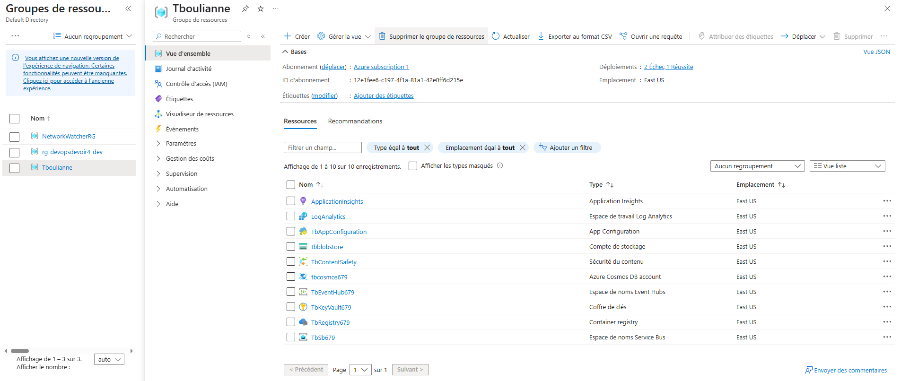

# Suivi des étapes du devoir – Itération 7

## Étape 1 : Création des bases cloud

- Personnalisation et déploiement automatisé des ARM templates (`CloudInfrastructure/azuredeploy.json` et `.parameters.json`) pour créer :
  - Key Vault, App Configuration, Storage Account, Service Bus, Cosmos DB, Event Hub, Container Registry, etc.
- Gestion de l’unicité des ressources globales (suffixe `679`).
- Toutes les ressources nécessaires sont créées dans le groupe Tboulianne.
- Aucun secret ou paramètre sensible n’est codé en dur : tout est géré via Azure App Configuration et Key Vault.

## Étape 2 : Création du registre de conteneurs

- Azure Container Registry (ACR) déployé et sécurisé.
- Suppression de tout secret dans les images et Dockerfile : utilisation exclusive de variables d’environnement injectées au runtime.

## Étape 3 : Compilation et déploiement des conteneurs

- Pipelines Azure DevOps configurés pour :
  - Compiler et builder les images Docker pour chaque composant (API, MVC, Worker_Content, Worker_Image, Worker_DB).
  - Publier les images dans l’ACR.

## Étape 4 : Création des infrastructures cloud

- Déploiement automatisé d’AKS (Kubernetes) via ARM pour héberger les 5 conteneurs.
- Fichier `DeployKube/Cluster.yml` prêt pour le déploiement de tous les composants.

## Étape 5 : Orchestration & autoscaling

- Déploiement Kubernetes automatisé via pipeline (azure-pipelines-3.yml).
- Injection sécurisée des secrets dans les pods via le secret Kubernetes `my-secret`.
- Autoscaling configuré :
  - HPA pour API et MVC (scaling CPU).
  - KEDA pour Worker_Content et Worker_Image (Service Bus TbSb679), Worker_DB (Event Hub TbEventHub679).
- Ajout des objets TriggerAuthentication et secrets Kubernetes pour KEDA (créés automatiquement depuis Key Vault).

## Étape 6 : Déploiement automatisé sur l’infrastructure

- Pipeline Azure DevOps applique automatiquement le fichier Cluster.yml sur AKS après création des secrets.
- Tous les déploiements sont reproductibles et automatisés.

## Étape 7 : Tests de fonctionnement (à venir)

- Prochaine étape : tester la scalabilité (autoscaling), l’intégrité, la sécurité et la performance des services.
- Préparer des scripts/tests et captures d’écran pour la documentation finale.

## Étape 8 : Gestion des identifiants Azure AD et secrets d'accès

- Création d'une Application Registration (Azure AD) pour l'authentification des services cloud.
  - Récupération de l'ID d'application (ClientID), de l'ID du locataire (TenantID) et génération d'un secret client (ClientSecret).
- Ajout de ces identifiants comme **secrets** dans Azure Key Vault (noms : `ClientID`, `TenantID`, `ClientSecret`).
- Automatisation de la création/mise à jour de ces secrets dans le script `CloudInfrastructure/Deploy-AzureResourceGroup.ps1`.
- Le pipeline Azure DevOps lit dynamiquement ces secrets depuis Key Vault et les injecte dans Kubernetes via le secret `my-secret`.
- Les applications .NET consomment ces identifiants via les variables d'environnement, sans jamais exposer de secrets dans le code ou les images Docker.

---

**Livrables en cours de constitution** :
- Documentation détaillée (ce fichier)
- Scripts ARM, YAML, pipelines
- Rapport des modifications et choix techniques
- Captures d’écran et résultats de tests (à venir)